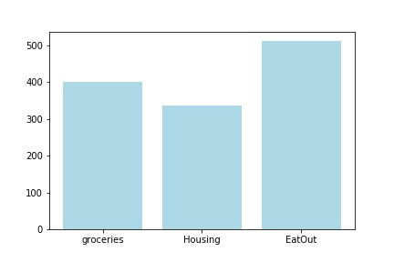

# FinancialAccountAdvisor
FinancialAccountAdvisor as part of APIThon

This is our  'Trusted ADvisor API'- This API analyses  & categorises transactions and publishes the graphical output.

The intent is to identify the "surplus" amount /that the consumer could pool in/ to other investments or pay off the liabilities.
****
Using the Existing APIs we were able to come up with the following endpoints:

>**ACCOUNT_LISTALL_ENDPOINT = "/accountsInfo";**
>-  This is for retrieving a subset of the Accounts resulting just the AccountIdentificationNumber and AccountNickName. This can be used to render display to user.

    {
        "AccountInfo": [
            {
                "AccountIdNum": "50000012345602",
                "AccountName": "Savings Account - NatWest - Sydney"
            },
            {
                "AccountIdNum": "50000012345601",
                "AccountName": "Debit Account - RBS - Sydney"
            },
            {
                "AccountIdNum": "50000012345602",
                "AccountName": "Savings Account - RBS - Sydney"
            },
            {
                "AccountIdNum": "50000012345601",
                "AccountName": "Debit Account - NatWest - Sydney"
            }
        ]
    }

>**ACCOUNT_ID_BALANCESSUM_ENDPOINT = "/accounts/balances";**
>
>- Loop through all the accounts for which the user has provided Consent with and retrieves the Consolidated Balances of Credits and Debits.

    {
    "BalanceDetails": [
        {
            "AccountNo": "3e82c5e6-3d02-4dd9-a69b-cc6629734c2d",
            "DebitBalance": 0.0,
            "CreditBalance": 125680.92
        },
        {
            "AccountNo": "aff0ffe0-9275-49bb-917d-f946210d18d1",
            "DebitBalance": 0.0,
            "CreditBalance": 24.57
        },
        {
            "AccountNo": "c3746e19-582f-4829-9ec7-2b6a5aba12b8",
            "DebitBalance": 0.0,
            "CreditBalance": 125680.92
        },
        {
            "AccountNo": "da97d767-52ab-40cf-895c-5f1f6d663ec9",
            "DebitBalance": 0.0,
            "CreditBalance": 7041.77
        }
    ],
    "SumOfAllDebits": 0.0,
    "SumOfAllCredits": 258428.18376922607
    "AvgBalPerMonAvailable": 63615.80344963074
    }

>**ACCOUNT_ID_BALANCESSUM_MONTHLY_ENDPOINT ="/accounts/{accountId}/transactions/monthly"** 
>- Loop through all the Transactions done by a user, for a individual account, categorised on  monthly basis 
>- Credits for the current Month
>- Debits for the current Month
>- Net Balance for the current Month
>- Balance in comparision to Previous Month
>- Account Balance for that Month

    {
         "AccountNo": "da97d767-52ab-40cf-895c-5f1f6d663ec9",
         "MonthAndYear": "2018-10",
         "TotalCreditsCurMonth": 0.0,
         "TotalDebitsCurMonth": 322.13999938964844,
         "BalanceForThisMonth": -322.13999938964844,
         "BalanceForPrevMonth": 0.0,
         "AccBalCurrMonth": 19699.21
    }

>**ACCOUNT_ID_BALANCESSUM_MONTHLY_ENDPOINT_ALL ="/accounts/transactions/monthly"**
>- Loop through all the Accounts for which user has provided Consent with.
>- Again categorised by Month And Year, retrieves all the Debits and Credits , across all the accounts.

    {
        "MonthAndYear": "2018-10",
        "AllDebits": 322.13999938964844,
        "AllCredits": 500.0,
        "AvailBalanceForCurMonth": 290760.26
    }

>**ACCOUNT_ID_TRANSACTIONS_CATEGORY_MON_ENDPOINT = "/accounts/{accountId}/transaction_category/monthly";";**
>-  This is for retrieving a transactions in the month & assign a category
   
    {
        "category": "Regular Payments",
        "Amount": {
            "Amount": "26.48",
            "Currency": "GBP"
        }
    },
    {
        "category": "HouseHold Expense",
        "Amount": {
            "Amount": "26.48",
            "Currency": "GBP"
        }
    },
    {
        "category": "Dining",
        "Amount": {
            "Amount": "26.48",
            "Currency": "GBP"
        }
    },
    {
        "category": "Amazon",
        "Amount": {
            "Amount": "26.48",
            "Currency": "GBP"
        }
    }
]
>**ACCOUNT_ID_TRANSACTIONS_CATEGORY_SUM_ENDPOINT = "/accounts/{accountId}/transaction_category/total";;**
>-  This is for adding up all amounts against a category -> To produce categorical spending
   
    {
        "category": "Regular Payments",
        "Amount": {
            "Amount": "1234.48",
            "Currency": "GBP"
        }
    },
    {
        "category": "HouseHold Expense",
        "Amount": {
            "Amount": "2326.48",
            "Currency": "GBP"
        }
        
>**Visual Display of Spend Analysis 
>-  This is for displaying the graphical trend of amount spent against various categories

  Python module (app.py) to recive the json details containing category and amount and publish the graph.
  
